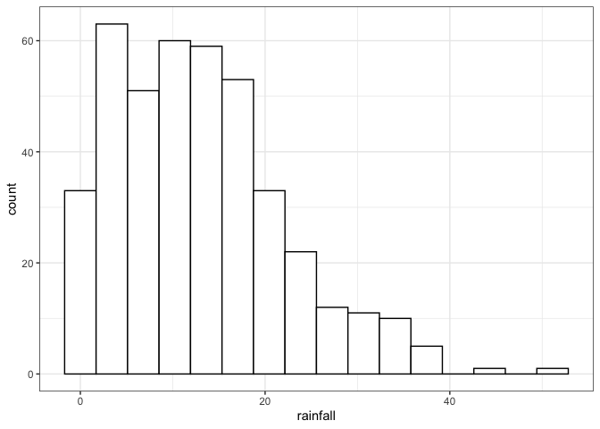

<!-- README.md is generated from README.Rmd. Please edit that file -->

# extrememix 

`extrememix` implements Bayesian estimation of extreme value mixture
models, estimating the threshold over which a Generalized Pareto
distribution can be assumed as well as high quantiles and other measures
of interest in extreme value theory.

## Installation

The package `extrememix` can be installed from GitHub using the command

``` r
# install.packages("devtools")
devtools::install_github("manueleleonelli/extrememix")
```

and loaded in R with

``` r
library(extrememix)
library(ggplot2)
```

## An applied analysis

We consider the `rainfall` dataset reporting the monthly maxima daily
rainfall (in mm) recorded at the Retiro station in the city of Madrid
between 1985 and 2020. The data consists of 414 monthly maxima since 18
months were discarded in which no rain was observed.

``` r
data("rainfall")
ggplot(data = data.frame(rainfall), aes(x=rainfall)) +
  geom_histogram(binwidth = 2*length(rainfall)^(-1/3)*IQR(rainfall), colour="black", fill="white") + theme_bw()
```



The data histogram shows that the maximum rainfall observed in a day is
around 50mm. Although there are some extreme observations, the
distribution appears to be right-bounded.

We start our analysis fitting the GGPD model (gamma bulk/GPD tail) using
the function `fggpd`. We specify the number of iterations, the burn-in
and the thinning via the options `it`, `burn` and `thin`, respectively.
The prior distribution, the starting values and the variances of the
proposal distributions are automatically chosen, but these can be set by
the user (see below).

``` r
model1 <- fggpd(rainfall, it = 50000, burn = 10000, thin = 40)
model1
#> EVMM with Gamma bulk. LogLik -1442.019 
#> xi estimated as  -0.1468146 
#> Probability of unbounded distribution  0.063
```

The `print` method for the object `model1` gives us an overview of the
estimation process, stating the model fitted, its log-likelihood, the
posterior estimate of the shape parameter $\xi$ of the GPD and the
probability that the distribution is right-unbounded. Additional details
can be gathered using the `summary` function.

``` r
summary(model1)
#>       estimate lower_ci upper_ci
#> xi       -0.15    -0.26     0.06
#> sigma     8.89     6.80    11.95
#> u        13.96     8.81    14.80
#> mu       16.26    14.35    20.35
#> eta       1.16     0.94     1.36
```

The `summary` reports the posterior estimates as well as 95% posterior
credibility intervals of the models’ parameters. The threshold is
estimated at 12.88 and the GPD is therefore estimated over a proportion
of the data equal to 0.4541063.

`extrememix` includes the function `check_convergence` which reports the
traceplot and the auto-correlation plot for the estimated 0.99 quantile.
It can be used as a quick check to ensure convergence of the estimation
algorithm. Other R packages can be used for more in-depth analyses.
According to the output, the estimation of the quantile is stable and
therefore it is likely that the chain reached convergence.

``` r
check_convergence(model1)
```


As an alternative model we consider the MGPD (mixture of gammas bulk/GPD
tail) with 2 mixture components. It can be fitted using the function
`fmgpd`, which needs as input also the number of components `k`. In this
case we fully specify the model and the estimation procedure by also
giving the starting values, the variances and the prior distribution.

The starting values can be set creating a list with entries `xi`,
`sigma`, `u`, `mu`, `eta` and `w`. The proposal variances can be set
creating a list with entries `xi`, `sigma`, `u`, `mu` and `w` (for each
mixture component the parameters $\mu$ and $\eta$ are sampled jointly).
The prior distribution can be set creating a list with entries `u` (a
vector with the mean and standard deviation of the prior normal
distribution for $u$), `mu_mu` (a vector with the prior means of the
Gamma distributions for $\mu$), `mu_eta` (a vector with the prior shapes
of the Gamma distributions for $\mu$), `eta_mu` (a vector with the prior
means of the Gamma distributions for $\eta$) and `eta_eta` (a vector
with the prior shapes of the Gamma distributions for $\eta$).

``` r
start <- list(xi = 0.2, sigma = 5, u = quantile(rainfall,0.9), 
              mu = c(4,10), eta = c(1,4), w = c(0.5,0.5))
var <- list(xi = 0.001, sigma = 1, u = 2, mu = c(0.1,0.1), w = 0.1)
prior <- list(u = c(22,5), mu_mu = c(4,16), mu_eta = c(0.001,0.001),
              eta_mu = c(1,4), eta_eta = c(0.001,0.001))
model2 <- fmgpd(rainfall, k =2, it = 50000, burn = 10000, thin = 40,
                start = start, var = var, prior = prior)
```

The summary below shows that an MGPD model is not actually required
since the estimate of the weight of one of the two components is zero.

``` r
model2
#> EVMM with 2 Mixtures of Gamma bulk. LogLik -1442.879 
#> xi estimated as  -0.1541957 
#> Probability of unbounded distribution  0.04795205
summary(model2)
#>       estimate lower_ci upper_ci
#> xi       -0.15    -0.28     0.03
#> sigma     9.12     6.85    12.54
#> u        13.88     8.18    14.91
#> mu1       0.00     0.00     0.00
#> mu2      16.75    14.58    21.70
#> eta1      0.00     0.00     0.00
#> eta2      1.13     0.91     1.35
#> w1        0.00     0.00     0.00
#> w2        1.00     1.00     1.00
```

Let’s anyway check the convergence of the algorithm to ensure the
estimation process went ok.

``` r
check_convergence(model2)
```


Since the MGPD model has one weight equal to zero, a GGPD is
recommended. We can anyway check that this is the case using model
selection criteria. `extrememix` implements the AIC, AICc, BIC, DIC and
WAIC criteria in the equally-named functions.

``` r
rbind(c(BIC(model1),BIC(model2)),c(DIC(model1),DIC(model2)),c(WAIC(model1),WAIC(model2)))
#>          [,1]     [,2]
#> [1,] 2914.167 2933.966
#> [2,] 2892.394 2886.498
#> [3,] 2897.517 2898.700
```

For simplicity, here we considered three model selection criteria. BIC,
DIC and WAIC all favor the GGPD. As already noticed in the literature,
the use of WAIC is recommended and indeed it selects the GGPD model.

We therefore next investigate the use of the GGPD model to assess
rainfall in the city of Madrid. The `plot` method gives an overview of
the model reporting the histogram of the distributions of $\xi$ and
$\sigma$, a plot of the quantiles and a plot of the predictive
distribution.

``` r
plot(model1)
#> Warning: The dot-dot notation (`..density..`) was deprecated in ggplot2 3.4.0.
#> ℹ Please use `after_stat(density)` instead.
#> ℹ The deprecated feature was likely used in the extrememix package.
#>   Please report the issue to the authors.
#> This warning is displayed once every 8 hours.
#> Call `lifecycle::last_lifecycle_warnings()` to see where this warning was
#> generated.
```


The predictive distribution can be further obtained using the function
`pred`. The plot shows that the model gives a faithful description of
the tail of the data.

``` r
pred(model1)
```


In extreme value analysis there are many measures that are used to
quantify risk: quantiles (implemented in `quant`), return levels (in
`return_level`), Value-at-Risk (in `VaR`), Expected shortfall (in `ES`)
and Tail VaR (in `TVaR`). For instance here we compute the return
levels, i.e. the value that is expected to be equaled or exceeded on
average once every interval of time (T).

``` r
return_level(model1)
#>       Level estimate lower_ci upper_ci empirical
#>  [1,]    20    30.40    28.15    32.93     30.20
#>  [2,]    25    31.86    29.49    34.61     32.44
#>  [3,]    30    33.01    30.55    35.97     34.05
#>  [4,]    40    34.75    32.10    38.22     34.87
#>  [5,]    50    36.02    33.26    39.90     35.27
#>  [6,]    60    37.07    34.17    41.46     35.80
#>  [7,]    70    37.89    34.91    42.71     36.65
#>  [8,]    80    38.60    35.54    43.75     37.02
#>  [9,]    90    39.21    36.07    44.69     37.39
#> [10,]   100    39.75    36.57    45.49     37.71
#> [11,]   150    41.76    38.32    48.51     38.52
#> [12,]   200    43.09    39.42    50.76     38.87
#> [13,]   250    44.08    40.21    52.58     41.13
plot(return_level(model1))
```


From the output we can see that we expect a rainfall of 30.42 mms to be
equaled or exceeded every 20 months. The width of the credibility
intervals can be chosen with the `cred` input and the values at which to
compute the return levels can be chosen with `values`.

As a different measure, we consider next the expected shortfall, defined
as the expected value in the q% of the worst cases. For instance, the
code below computes the 1% expected shortfall.

``` r
ES(model1, values = 1)
#>      ES_Level estimate lower_ci upper_ci empirical
#> [1,]        1    44.18    40.21    53.42     42.12
plot(ES(model1, values = 1))
```


In other words, conditional on observing a value above the 0.99
quantile, the expected rainfall is equal to 44.46mms.

Since we selected a unique `values` the plotting method reports the
posterior histogram of the estimated quantity.

To conclude the analysis, we can further estimate what is the largest
possible rainfall that could ever be observed in the city of Madrid,
since we observed that $\xi$ was often estimated as negative. This can
be done with the function `upper_bound`.

``` r
upper_bound(model1)
#> Probability of unbounded distribution:  0.063 
#> Estimated upper bound at  72.8  with probability  0.937 
#>  Credibility interval at  0.95 %: ( 54.38 , 387.85 )
plot(upper_bound(model1), xlim = c(20,400))
#> Upper Bound, with probability  0.937
```


The maximum rainfall that could be observed in Madrid is estimated as
88.08. Furthermore, since in the posterior sample there are some values
of $\xi$ which are positive, we have a non-zero probability that the
distribution is right-unbounded. The limits of the histogram are set
with the input `xlim`.
